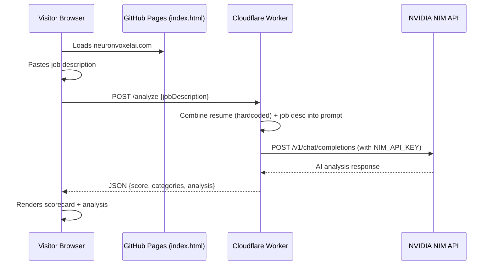

# AI Resume-Job Matcher — NeuronVoxel AI

Add an AI-powered section to `neuronvoxelai.com` where recruiters/clients paste a job description and instantly see how well Avithal's skills match their needs. Powered by NVIDIA NIM via a secure Cloudflare Worker proxy.

## User Review Required

> [!IMPORTANT]
> **API Key Security**: Your NIM key (`nvapi-IljS...`) will be stored as a **Cloudflare Worker secret** (encrypted at rest, never in source code, never in the browser). The frontend only talks to your Worker URL — the key is invisible to visitors.

> [!WARNING]
> **Rate Limits**: NVIDIA's free tier allows ~40 requests/minute. If the site gets heavy traffic, visitors may see throttling. Consider adding a simple client-side cooldown (e.g., 10-second delay between submissions) to prevent abuse.

## Proposed Changes

### Component 1: Cloudflare Worker (Backend Proxy)

A new project directory `d:\neuronvoxelai-site\worker\` (git-ignored) containing the secure API proxy.

#### [NEW] [worker/wrangler.toml](file:///d:/neuronvoxelai-site/worker/wrangler.toml)
- Worker configuration: name `neuronvoxel-nim-proxy`, compatibility date, account binding
- References the secret `NIM_API_KEY` (set via `wrangler secret put`)

#### [NEW] [worker/src/index.js](file:///d:/neuronvoxelai-site/worker/src/index.js)
- Handles `POST /analyze` endpoint
- Sets CORS headers to allow requests only from `neuronvoxelai.com` and `localhost`
- Reads job description from request body
- Constructs a prompt that includes:
  - Avithal's full resume (hardcoded in the worker — never sent to the browser)
  - The visitor's job description
  - Instructions to return: overall match %, category scores (Skills, Experience, Domain, Education), and a detailed analysis
- Calls `https://integrate.api.nvidia.com/v1/chat/completions` with the NIM API key from secrets
- Returns structured JSON response to the frontend
- Model: `meta/llama-3.1-70b-instruct` (single variable to swap)
- Includes a 10-second per-IP rate limit using the Workers KV or simple in-memory map

#### [NEW] [worker/package.json](file:///d:/neuronvoxelai-site/worker/package.json)
- Minimal package with `wrangler` as dev dependency

---

### Component 2: Frontend (index.html Update)

#### [MODIFY] [index.html](file:///d:/neuronvoxelai-site/index.html)
Add a new section between the existing cards grid and the CTA section:

**New "AI Skills Match" section includes:**
- Section header: "See How My Skills Match Your Needs" with subtitle
- A `<textarea>` for pasting the job description (placeholder text guiding the user)
- An "Analyze Match" button with loading state (spinner + "Analyzing...")
- Results panel (hidden until response arrives) containing:
  - **Scorecard**: overall % in a circular progress ring, plus 4 category bars (Skills, Experience, Domain Fit, Education)
  - **Detailed Analysis**: rendered markdown-style text below the scorecard
- Error state handling (network errors, rate limits, empty input)
- All new CSS stays inline in the existing `<style>` block, matching the dark purple theme
- Fully responsive: stacks vertically on mobile, side-by-side scorecard/analysis on desktop
- Smooth fade-in animation for results
- 10-second client-side cooldown on the submit button after each request

---

### Component 3: Configuration & Gitignore

#### [MODIFY] [.gitignore](file:///d:/neuronvoxelai-site/.gitignore)
Add:
```
worker/node_modules/
worker/.wrangler/
```
(The `worker/` source code itself *will* be committed — it contains no secrets. Secrets are set via `wrangler secret put`.)

---

### Component 4: Node.js Installation

- Install Node.js LTS via `winget install OpenJS.NodeJS.LTS` (built into Windows)
- Verify with `node --version` and `npm --version`
- Required for `npx wrangler` to deploy the Cloudflare Worker

---

## Architecture Diagram



## Execution Order

1. **Install Node.js** via winget
2. **Scaffold Cloudflare Worker** project in `worker/`
3. **Write the Worker code** (proxy + prompt + CORS)
4. **Deploy Worker** with `npx wrangler deploy`
5. **Set the NIM API key** secret via `npx wrangler secret put NIM_API_KEY`
6. **Update `index.html`** — add the AI matcher section with all styling
7. **Update `.gitignore`** — add worker build artifacts
8. **Test end-to-end** — paste a sample job description, verify scorecard renders
9. **Commit & push** to GitHub
10. **Update `handoff.md`** using the handoff skill format

## Verification Plan

### Automated Tests
- `curl` the deployed Worker endpoint with a sample job description and verify JSON response structure
- Test CORS by checking that requests from non-allowed origins are rejected
- Test rate limiting by sending rapid requests

### Manual Verification
- Open `neuronvoxelai.com` on desktop, tablet (responsive), and phone viewport
- Paste a real job description and verify scorecard + analysis renders correctly
- Check DevTools Network tab to confirm API key is NOT visible in any request/response
- Test error states: empty input, network offline, rapid clicking
